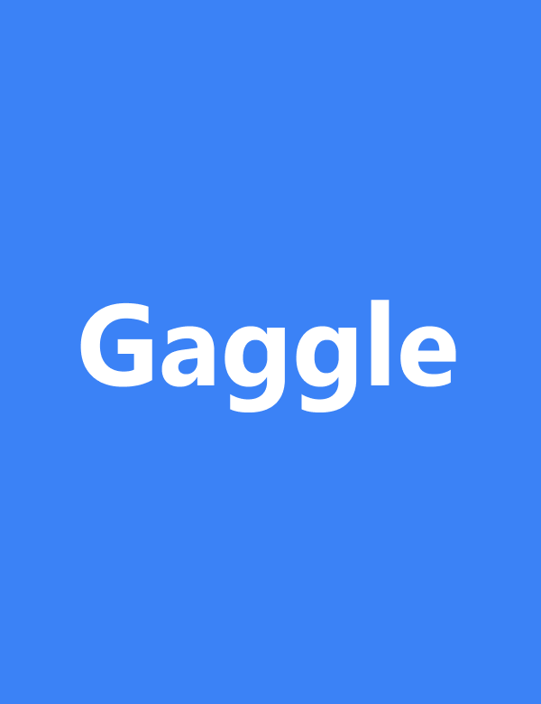
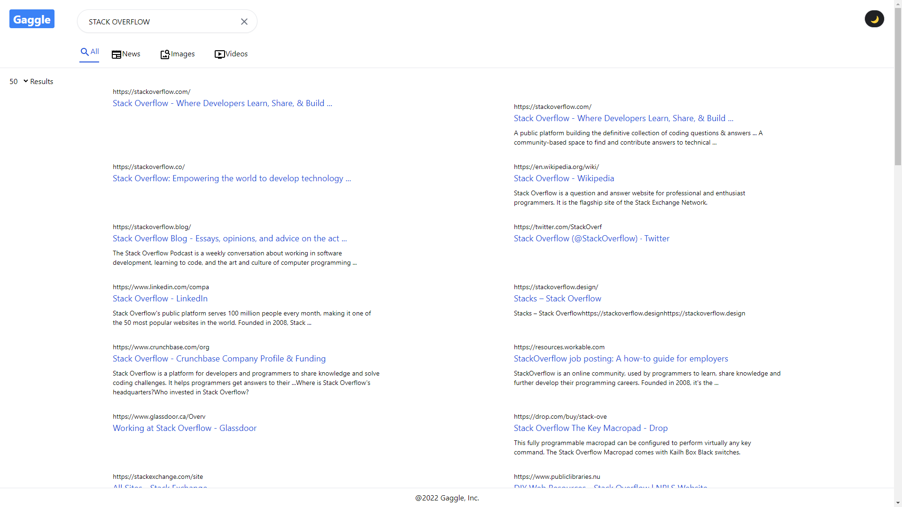
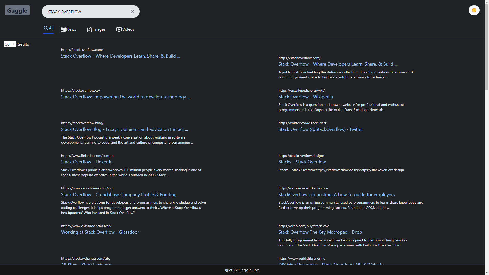
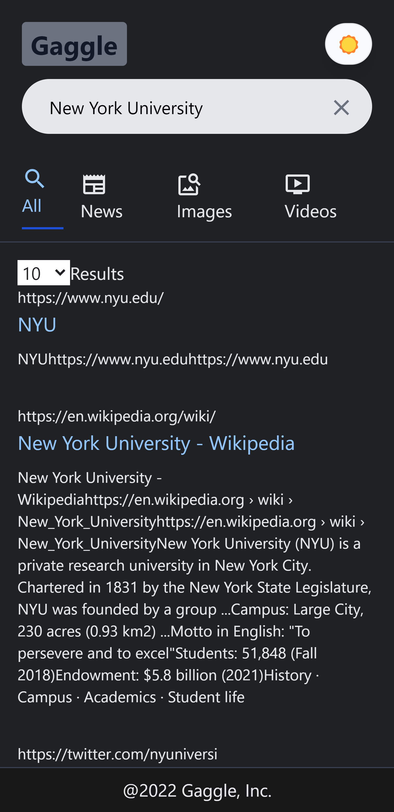

<h1 align="center"> Gaggle </h1>  

  

Gaggle, is a Google Search Clone, allows user to search for results, such as news, iamges, videos with a free Google Search API, provided by the Rapid API community.

<!-- START doctoc generated TOC please keep comment here to allow auto update -->
<!-- DON'T EDIT THIS SECTION, INSTEAD RE-RUN doctoc TO UPDATE -->

## Table of Contents

- [Introduction](#introduction)
- [Features](#features)
- [Feedback](#feedback)
- [Build Process](#build-process)

<!-- END doctoc generated TOC please keep comment here to allow auto update -->

## Introduction

  

## Features

#### Gaggle is aimed to replicate the same user experience just like Google. To start this project, the first issue I encountered is to find any mock data or free API so that I could fetch data, filter and present them on the webpage. Without much efforts, I replicated the Google-like layout and theme with Tailwind CSS.

A few hightlights:

- Darkmode

  

- Mobile-ready responsive design

  

- Option to choose display count

## Feedback

Feel free to send me feedback on [Any of my Social Media Account](https://github.com/AnthonyZhang220) or [file an issue](https://github.com/AnthonyZhang220/portfolio-website/issues/new). All contributors are always welcome.

If there's anything you'd like to chat about, please feel free to join my discord [Server](https://discord.gg/xkPRmn2HRb)!

## Build Process

- Clone or download the repo
- `npm install` to install dependencies
- `npm start` to start the packager and run the app on localhost:3000
